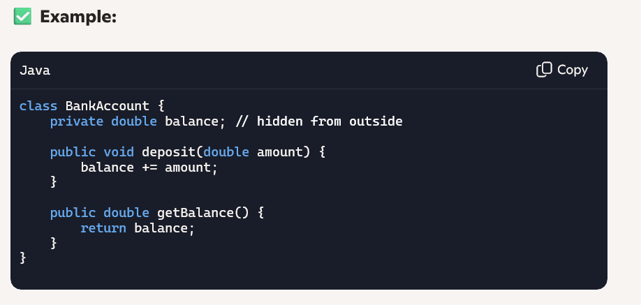

🧱 1. Encapsulation — "Protecting the Data"
Encapsulation means hiding internal details and exposing only what’s necessary through methods.

🎯 Why it matters:
• 	Keeps data safe
• 	Controls how data is accessed or modified

🧬 2. Inheritance — "Reusing Code"
Inheritance allows a class to inherit properties and methods from another class.
✅ Example:

🎯 Why it matters:
• 	Promotes code reuse
• 	Helps build hierarchical relationships

🎭 3. Polymorphism — "Same Action, Different Behavior"
Polymorphism lets you use one interface or method in different ways.
✅ Example:

✅ Usage:

🎯 Why it matters:
• 	Makes code flexible and scalable
• 	Supports method overriding and dynamic behavior

🧩 4. Abstraction — "Showing Only Essentials"
Abstraction means hiding complex implementation and showing only the necessary features.
✅ Example using Abstract Class:

✅ Example using Interface:

🎯 Why it matters:
• 	Simplifies usage
• 	Focuses on what an object does, not how

💼 Business Analogy
• 	Encapsulation: Like a company’s HR system — employees can’t see each other’s salaries directly.
• 	Inheritance: Like a franchise — each outlet inherits the brand’s standards.
• 	Polymorphism: Like customer support — same greeting, but different solutions based on the issue.
• 	Abstraction: Like using an ATM — you don’t need to know how it works internally, just how to use it.